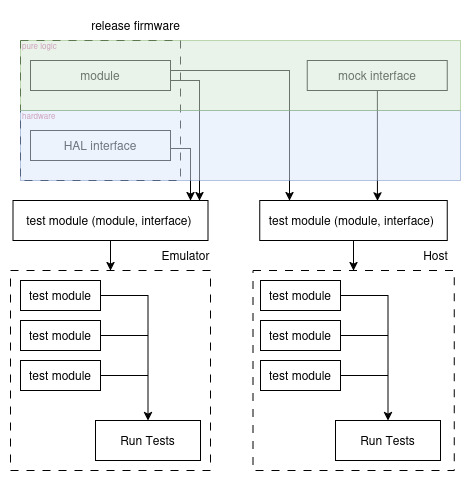
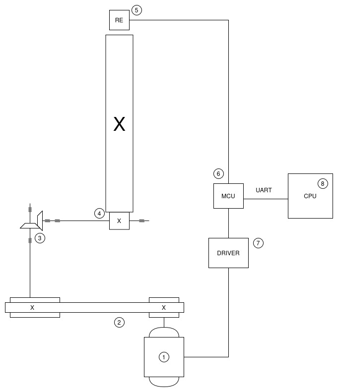

# STM32 Motor Control

  

## Description

Motor control project using TDD ( Unity ) with the goal of integrating it into a turntable system.

UART is set up for integration with QEMU.

## Design Goals

### 1. Hardware Abstraction Layer (HAL)

**Objective:**  
Design clean, minimal interfaces to decouple hardware details from application logic.

**Why it matters:**  
By abstracting hardware, we make core logic portable, testable, and reusable across platforms.

**Tasks:**
- [ ] Define HAL interfaces (e.g. `pwm_interface.h`, `uart_interface.h`)
- [ ] Replace direct calls to `HAL_*` / `LL_*` with abstracted methods
- [ ] Ensure core algorithms rely only on interfaces, not hardware

### 2. Dependency Injection

**Objective:**  
Inject hardware interfaces or function pointers instead of hardcoding dependencies.

**Why it matters:**  
Makes it easy to swap real hardware with mocks or stubs for testing and simulation.

**Tasks:**
- [ ] Refactor modules to receive hardware accessors via parameters
- [ ] Remove hardcoded peripheral calls from business logic
- [ ] Provide constructor/init-style functions that accept interface pointers

### 3. Strategic Use of Test Doubles

**Objective:**  
Create mocks, stubs, and fakes to simulate hardware behavior for unit tests.

**Why it matters:**  
Reduces reliance on physical hardware and enables testing of edge cases with precision.

**Tasks:**
- [ ] Set up a unit test framework (e.g. Unity + Ceedling)
- [ ] Implement mocks for I2C, UART, ADC, timers, etc.
- [ ] Simulate fault conditions, timing delays, and sensor inputs in tests

### 4. Host-First Testing Strategy

**Objective:**  
Run the majority of tests natively on the development machine or QEMU.

**Why it matters:**  
Faster test execution, easier CI integration, and quicker development cycles.

**Tasks:**
- [ ] Compile tests for host platform (e.g. using GCC or QEMU)
- [ ] Use target hardware only for final integration and signal validation
- [ ] Automate test runs in CI using native builds

## Development Workflow

  

1. **Test-Harness Synchronization**: Any changes made by code-regeneration in STM32 CubeMX are reflected in the
   test-harness, ensuring the test environment is identical to the production environment.
2. **UnityTest**: All production code is first tested in UnityTest, a unit-test framework well suited to embedded developement.
3. **Qemu**: Qemu provides an on-host test environment through hardware emulation. It has in-built support for STM32 emulation through several development boards. This allows us
   to test early on-host, giving a tight development loop perfect for TDD.
4. **Proteus**: Proteus provides emulation for STM32 MCUs, like Qemu, but also models pins, allowing us to run firmware and do signal analysis. This lets us treat the MCU as a black-box with clear outputs that we can test before integration with peripherals.

### Interfaces and Mocking

  

## Target System

The goal is to make the motor control meet the requirements of the system shown below.

  

1. **Power Source**: Three-phase AC motor
2. **Belt-drive**: Provides speed reduction and absorbs vibrations from the motor.
3. **Bevel-gear transmission**: Provides both speed (RPM) reduction and a change in the direction of power transmission.
4. **Pinion gear + slew-bearing with integrated ring gear**: This is the target output of the power-train.
5. **Rotary encoder**: Sensor to measure the rotation of the ring gear.
6. **MCU**: microcontroller for motor-control.
7. **Motor-drive**: Three-phase inverter composed of six power transistors, used to generate variable-frequency AC for motor control.
8. **CPU**: multi-core CPU that provides movement commands to the MCU.

### Ring-Gear Rotation Detection

