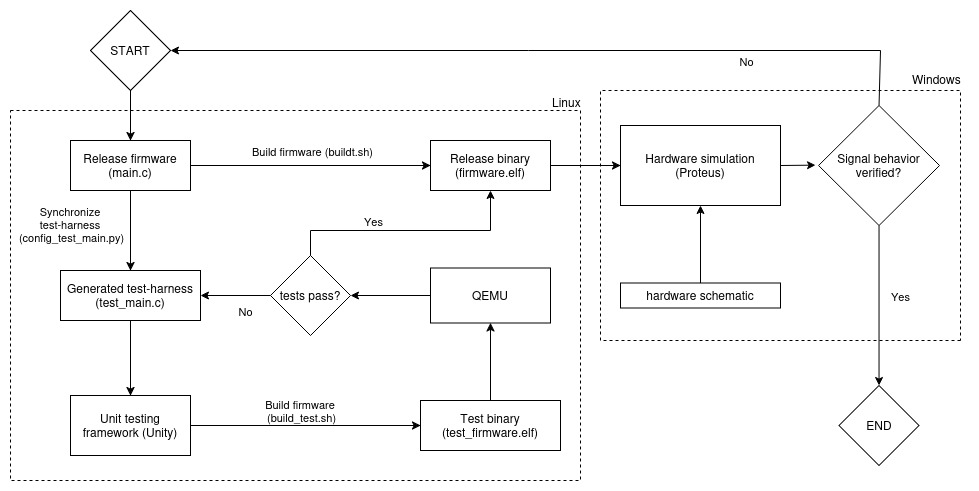

# STM32 Motor Control

  

## Description

Motor control project using TDD ( Unity ) with the goal of integrating it into a turntable system.

UART is set up for integration with QEMU.

## Development Workflow

  

1. **Test-Harness Synchronization**: Any changes made by code-regeneration in STM32 CubeMX are reflected in the
   test-harness, ensuring the test environment is identical to the production environment.
2. **UnityTest**: All production code is first tested in UnityTest, a unit-test framework well suited to embedded developement.
3. **Qemu**: Qemu provides an on-host test environment through hardware emulation. It has in-built support for STM32 simulation through several development boards. This allows 
   to test early on-host, giving a tight development loop perfect for TDD.
4. **Proteus**: Provides emulation for STM32 MCUs, allowing us to run firmware and do signal analysis. This lets us treat the MCU as a black-box with clear outputs that we can test before integration with peripherals.
